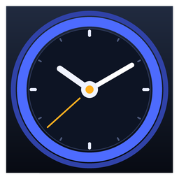

# 🕐 DeepSeek Price Clock

A tiny **portable Windows widget** that shows DeepSeek API token prices **right now** — in **your local time**, wherever you are — with a live countdown to the next price change, so you always know whether you're paying peak or off-peak rates.



## Why?

DeepSeek bills by the hour: during **peak hours** (full price) and **off-peak hours** (50% off). The hours are defined in **UTC on weekdays only**, which makes them awkward to track for anyone living in Israel — especially since the local times shift with daylight saving time. This app does the math for you, automatically.

**Peak hours (UTC):** `01:00–04:00` and `06:00–10:00`, Monday–Friday — everything else (including weekends) is off-peak at half price.

> Example (Israel summer time, UTC+3): peak = `04:00–07:00` and `09:00–13:00` Israel time. In winter the same windows shift to `03:00–06:00` and `08:00–12:00`. The app computes all of this itself — including DST transitions.

## Features

- 🕐 **Live local clock** — auto-detects the machine's time zone (works anywhere in the world) with Hebrew/English date
- 🕰️ **Analog clock option** — switch between a big digital clock and a classic analog face
- 💰 **Current DeepSeek prices** per 1M tokens (USD) for all three models — `deepseek-v4-flash`, `deepseek-v4-pro`, `deepseek-v4-flash-vision-exp` (input cache-hit, input cache-miss, output)
- 🔄 **Live countdown** to the next price change, plus the next 4 changes with dates & times in your local time
- 🌐 **Automatic price updates** — the app fetches the official [DeepSeek pricing page](https://api-docs.deepseek.com/quick_start/pricing) on startup, every 30 minutes, and on demand. It validates the data before applying it and falls back to a built-in snapshot (with a clear status message) if the site is unavailable.
- 📅 **DST-aware** — peak windows are converted from UTC on the fly, so each user's local summer/winter time is always correct
- 🌍 **Bilingual** — Hebrew & English, switch anytime with one click (the app remembers your choice; first launch auto-detects the Windows UI language)
- 📦 **100% portable** — single `.exe`, no installation, no Python needed. Runs on any 64-bit Windows 10/11. Copy it to a USB stick and go.

## Download

Grab the latest build: [`dist/DeepSeekPriceClock.exe`](dist/DeepSeekPriceClock.exe) — it's a single self-contained file (~11 MB).

> On first run on a new machine, Windows SmartScreen may warn about an unknown publisher (the app is not code-signed). Click **More info → Run anyway**. The app never writes outside your user profile.

## Usage

1. Double-click `DeepSeekPriceClock.exe` — that's it.
2. Green card = **off-peak** (50% off). Amber card = **peak** (full price).
3. Use the **Update now** button or wait — prices refresh automatically every 30 minutes.
4. Click **English / עברית** to switch the interface language, or **Analog / Digital** to change the clock style.
5. The time zone is detected automatically from your system — no setup needed.
6. "Always on top" keeps the clock visible above other windows.

## Building from source

Requires Python 3.9+ (tkinter included) on Windows:

```bat
pip install pyinstaller pillow
python -m PyInstaller --onefile --windowed ^
  --name DeepSeekPriceClock ^
  --icon DeepSeekClock.ico ^
  --version-file version_info.txt ^
  deepseek_clock.py
:: result: dist\DeepSeekPriceClock.exe
```

- `deepseek_clock.py` — the whole app (logic + UI) in one file
- `gen_icon.py` — regenerates `DeepSeekClock.ico` from scratch with Pillow
- `version_info.txt` — Windows file metadata (right-click → Properties)

## How the auto-update works

The app tries, in order:

1. the official pricing page — including the `…/index.html` variant (DeepSeek's docs deployment has at times served stale content on the clean URL while the real page lived at the `.html` path)
2. any pricing URL discovered via the docs sitemap
3. the built-in snapshot, with a status message and automatic retry

Every result is validated (positive prices, sane peak/off-peak ratios, ≥2 models) before it replaces the displayed data — including the peak-hour windows themselves, so if DeepSeek ever changes the schedule the app follows along.

## Disclaimer

Prices and peak hours are fetched from DeepSeek's official documentation and may change. This project is not affiliated with DeepSeek. Verify current rates on the [official pricing page](https://api-docs.deepseek.com/quick_start/pricing) before making financial decisions.

---

## עברית

שעון מחירי טוקנים של DeepSeek לפי שעון ישראל: מראה את המחיר הנוכחי ל-1M טוקנים (שלושת הדגמים), סופר לאחור עד לשינוי המחיר הבא, ומתעדכן אוטומטית מול האתר הרשמי כל 30 דקות. קובץ נייד יחיד — ללא התקנה. מחיר מלא בשעות `04:00–07:00` ו-`09:00–13:00` (שעון ישראל, קיץ) בימי חול בלבד; כל השאר — 50% הנחה. התוכנה מזהה אוטומטית את אזור הזמן של המחשב (כולל שעון אנלוגי) — כך שהיא עובדת נכון בכל מקום בעולם.
